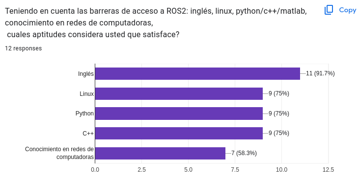
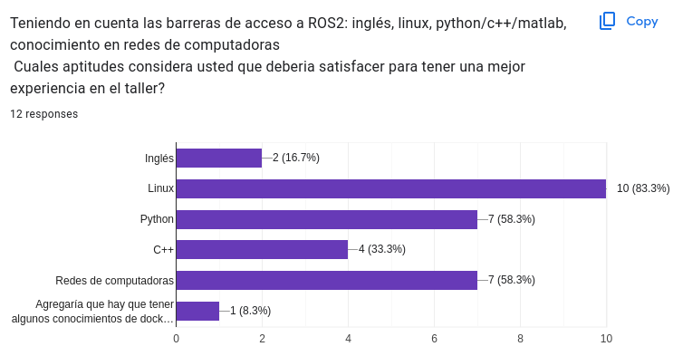
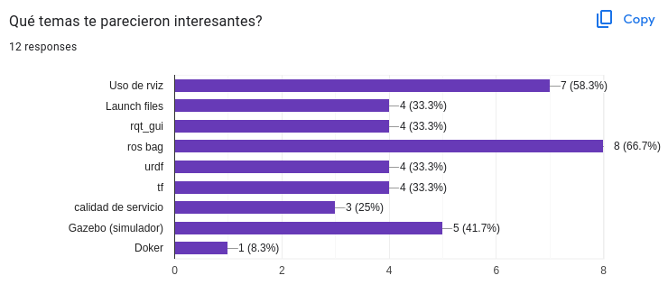
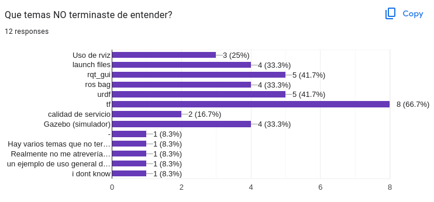
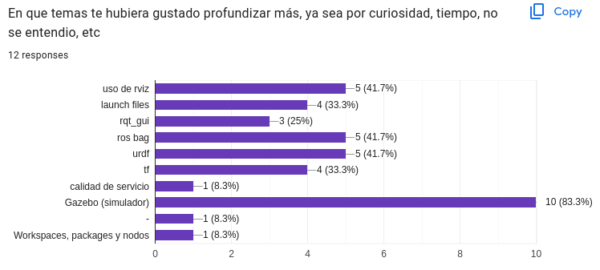
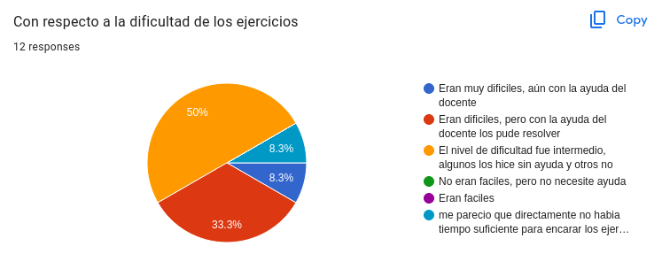
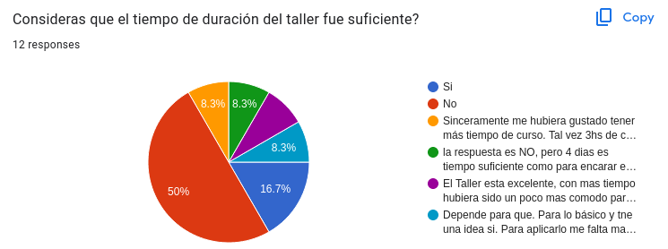
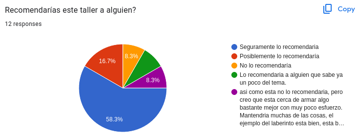

# Resultados de la encuesta
Estos son los resultados de la encuesta. Los datos exportados desde google forms estan en el archivo [CSV](Taller_ROS2.csv). A continuación se muestran algunas capturas y respuestas en texto plano.
## Las preguntas del tipo multiple choice fueron las siguientes:

## Preguntas para responder con texto:

#### Que cambiarías de las diapositivas utilizadas en clase? (en terminos generales)
- agregaria mas explicacion de porque ROS2  es importante aprenderlo y mas intro teorica
- Necesitan un poco mas de texto/explicacion. A veces no quedan muy claras, tal vez si estamos haciendo un ejercicio a la vez, ir a las diapos no siempre sirve porque no estan super claras.
- Le agregaría los comandos de linux necesarios
- Poner una diapositiva con todas las instrucciones a ejecutar para esa práctica
- Creo que en términos generales están muy bien. Condensan mucha información que leyendo por mi cuenta no vi toda junta. Además las notas en las slides son muy útiles.
- Entendiendo a las diapositivas como un material de soporte para el docente, creo que están bien. Ahora, si las diapositivas son la "bibliografía principal del taller" incluiría enlaces directos a la documentación del tema que aborda la bibliografía. Comandos en formato texto para que sea fácil de copiar y pegar. Explicaciones del significado de la sintaxis.
- las diapositivas trataban de estar mas apuntadas al orador que al alumno. El problema mas grande pareciera estar en el hilo conductor del curso, yo trataria de ordenar mas que es lo que se quiere transmitir y sobre todo recortar temas y dejar links para que despues los que quieran puedan profundizar. Falto mucho dise~no grafico a las diapositivas
- Me parecieron adecuadas y entendibles
- Estan perfecto, solo falto tiempo para poder explicar y para poder probar los ejemplos a fondo.

#### Qué cambiarías de la forma de dar las clases? (12 respuestas)
- Más teoría.
- Tendrían que ser un poco más largas, vimos todo muy por arriba entonces termina siendo todo un poco confuso.
- Agregaría más tiempo de duración de las clases.
- Que los ejercicios no sean dependientes del anterior.
- Tal vez sumaría a alguien más para ayudar cuando alguien se traba.
- Obviamente, es ajeno al taller pero no se respetó el horario formal. Otra cosa que podría haber ayudado es que el docente tenga una computadora y que ejecute las instrucciones en simultáneo con nosotros (proyectando) para tener una referencia.
- Me pareció totalmente innecesario el "gasto" de tiempo en explicar C++, directamente apuntaría a trabajar con Python. Si me parece bien mencionar que también se puede trabajar en C++ pero no gastaría nada de tiempo.
- Otro de los grandes problemas era el tiempo disponible para la cantidad de temas. Dos horas si bien no es mucho tiempo, quizás ordenando más el discurso se puede aprovechar mejor el tiempo.
- El tema del horario es otro punto a mejorar, todas las clases empezaron y terminaron a destiempo, creo que es clave para la organización que se respeten estos tiempos. Después si una clase se estira no pasa nada, pero arrancar todos los días 30, 40, 70, 45 min tarde me parece que no es aceptable.
- Las clases me parecieron adecuadas, me costó al principio comprender la finalidad de ROS2, pero al final todo cerró.
- Estuvo perfecto, solo faltó tiempo para poder explicar y para poder probar los ejemplos a fondo.
- Más práctica o ejemplos(?).

#### ¿Cómo evaluarías a la persona que dictó el taller? (12 respuestas)
- 8.
- Bien, buena onda el profe y me pareció que explicó bastante bien.
- Un capo.
- Buen expositor y conoce del tema.
- El curso me parece excelente. Creo que está pensado como una presentación de ROS2, pero eso va en desmedro de la profundidad. No obstante, prefiero un curso como este y ahora sentarme por mi cuenta a practicar. Tal vez se podría agregar un medio de consulta o canal de slack o discord para esto (aunque esto puede ser más laburo para el docente :-)).
- Todo me pareció correcto.
- Creo que estaba muy bien predispuesto y se lo notaba apasionado por el tema lo cual es clave. El nivel del curso subiría mucho si se organiza mejor los temas.
- Muy predispuesto a ayudar y que entendamos, las clases fueron muy didácticas, y fuimos aprendiendo entre todos y todas.
- Entusiasta.
- Excelente predisposición, solo faltó tiempo para poder terminar de explicar algunos ejercicios y para poder probar los ejemplos a fondo.
- Muy bien!

#### Si hay algún comentario que no pudo ser cubierto con las anteriores preguntas, o bien usted quiere dejar algo dicho, éste es el espacio para hacerlo.(12 respuestas)
- todo ok! exitos, se puede mejorar!!
- No me parecio muy introductorio. No me quedaron del todo claro los conceptos, me quedo una vista por arriba, por lo que me gustaria una version de este curso pero mas larga. La parte de programar los robots, que es la mas divertida, fue a la que menos tiempo se le dedico. Me parecio un poco desorganizado y que los ejercicios no eran los mejores para dejar claros los temas vistos. Me hubiera gustado un poco mas de practica con instrucciones un poco mas claras.
- Muy buen taller che.
- Se pueden incluir alias para iniciar las docker o para ejecutar lo que ya se realizó y no estar repitiendo siempre.
- Vine a este curso sabiendo algo de ROS1. El curso me sirvió para conectar muchos conceptos y conocer la forma de trabajo con ROS2. Sebastián sabe un montón y no tiene problema en quedarse después de clase para ayudarte. Las clases son súper llevaderas. Más allá de su calidad docente tiene una gran calidad como persona.
- Me gustaría que el readme del repositorio, sobre todo para el primer ejercicio, "el de los nombres". También estaría bueno que esté documentado como entrar a docker y algún glosario de comandos útiles junto con su funcionalidad.
- gracias por el tiempo
- Quiero agradecer a las JAR por brindar el taller y a Seba por dictarlo, me sirvió un montón como primer pantallazo a ROS2.
- no ninguna
- El Taller estuvo genial. Otro tema para ayudar a entender podria ser el dificil tema de instalar ROS
capaz entendía mas con mas tiempo onda una vez por semana. 
Gracias!
Muy lindo taller
felicitaciones

